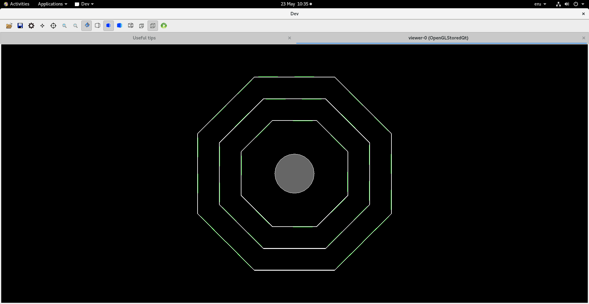
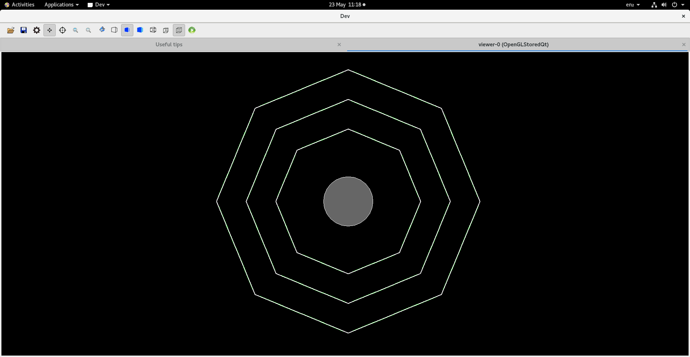
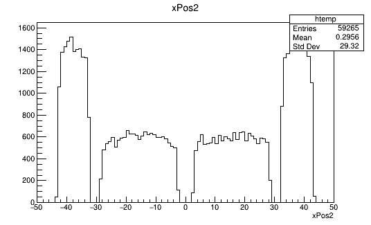
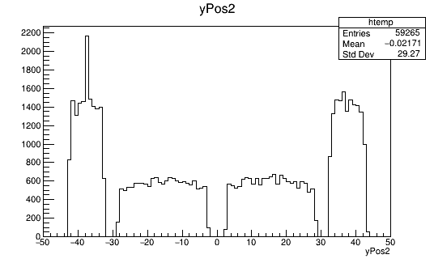
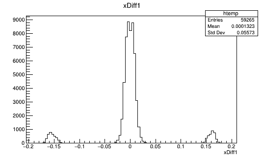
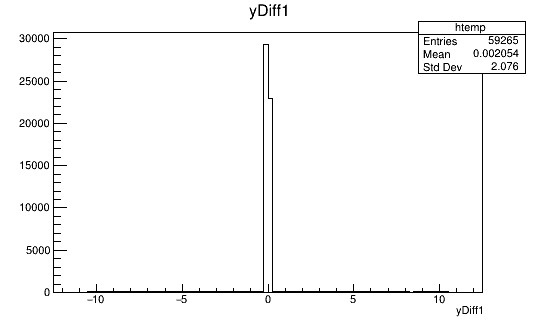
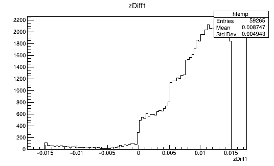

# Development Timeline

This will be a timeline to outline the development process.

Timeline section:

1. [Week 0-4](./Week0-4.md)
2. [Week 5-8](./Week5-8.md)
3. [Week 9-12](./Week9-12.md)

## 23/05/2023

### Modifying detector shape

A new octagonal detector is going to be tested. Even though this design will increase the amount of passive area, the CALIFA will have passive area that follows an octagon.

This is the new detector shape as for now:

### Adding offset

To make the system match more closley to the plans, I have added an small angular offset to the entire detector. Here is the new orientation:

### First test

I have ran the first test to see the distribution of the particles that it could detect. There are some significant changes. 

The first difference is the x and y values that it can record:

|Octagon|Hexagon|
|---|---|
|||
|||

Unlike the hexagon configuration, this pattern was the same for all layers (2,3, or 4 HICs per stave). The z plot was very similar.

The next difference, which I think is a not as intended and should be investigated is with the error in the position measurements in the first place

|Octagon|Hexagon|
|---|---|
|||
|||
|||

The error in the z direction seems to be pretty much unchaged, while the x and y directions have a few much larger errors. I want to reduce these outlier errors as much as possible. It must have something to do with the method that is being used to get the points of the pixels via the volume tree. This will be investigated.

