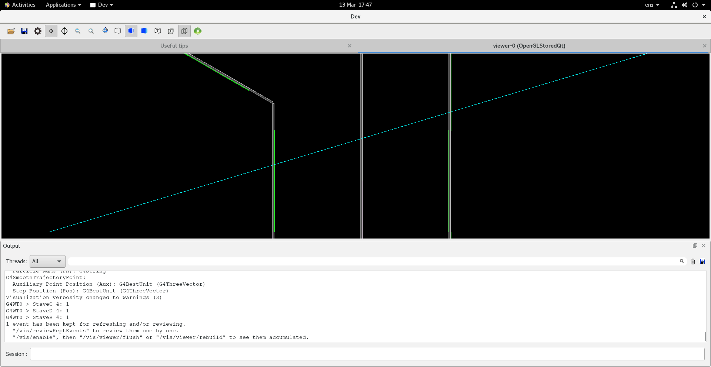
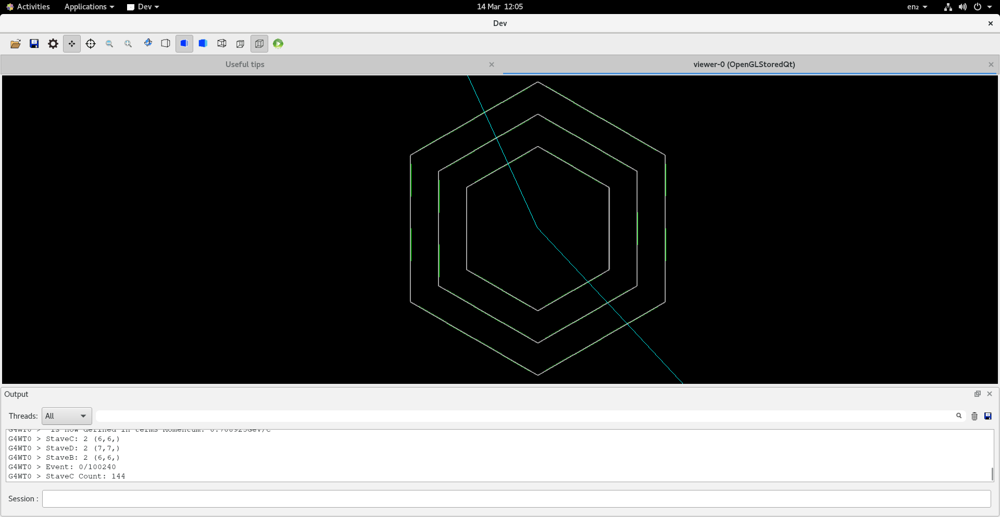
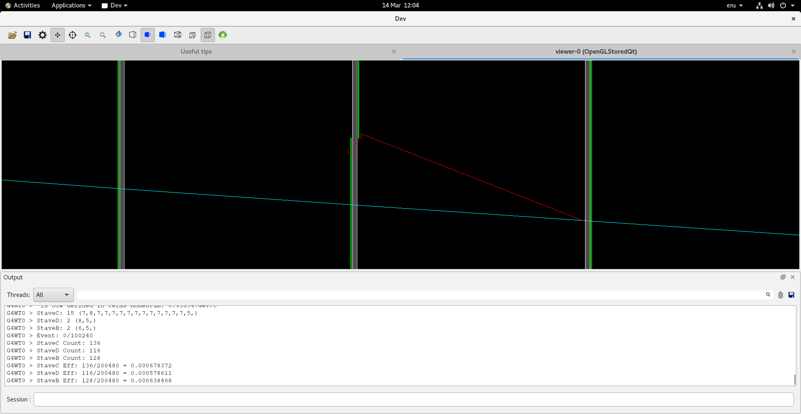
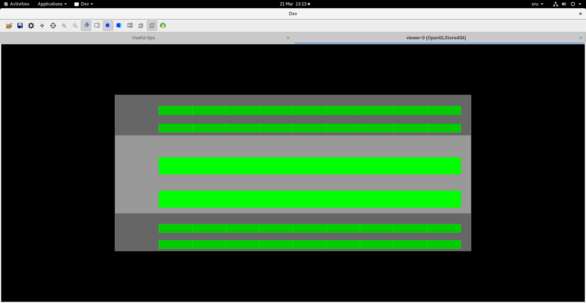
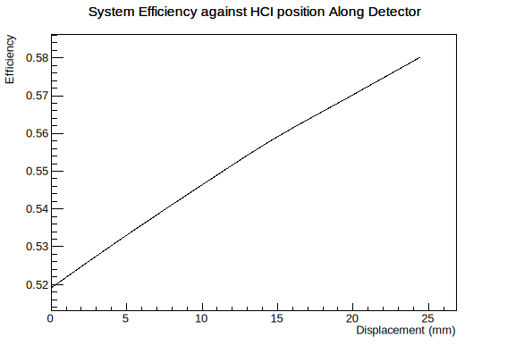
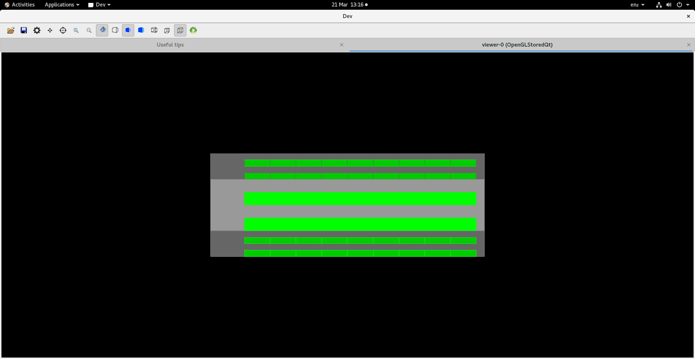
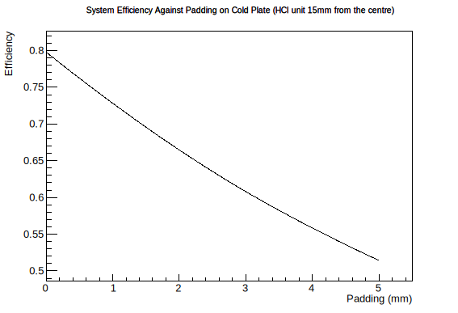
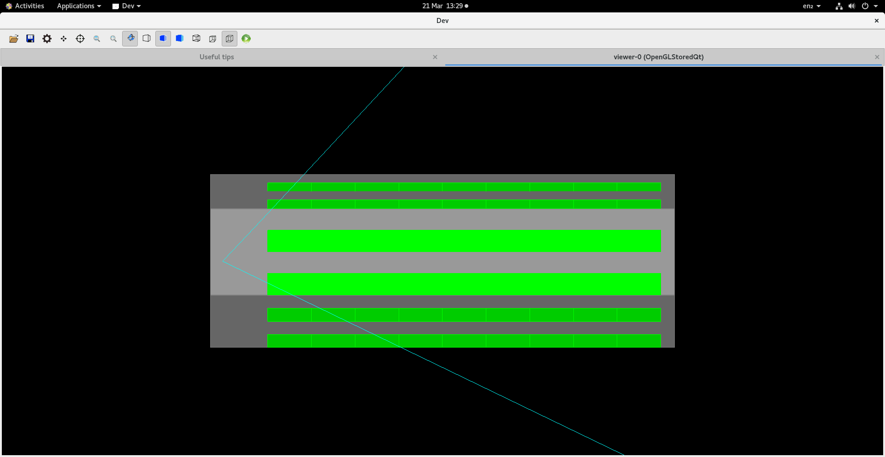

# Development Timeline

This will be a timeline desplaying screenshots taken to outline the development process.

## The cold plates were initially generated using an assembly volume.


## The thickness was fixed and all 3 layers were added


## Orientation was fixed and a scale was shown


## Assembly volume was scrapped and mother volumes where used to create the HCI unit ontop of the cold plate


## Multiple, alternating HCI units were placed on the plate


## Stave C was generated


## All staves were added in the correct shape


## Added sensitive detectors ("Chips" layers only)


## NOTE the printout showing each layers is distinct from eachother



## Implimented the ability for the program to count the number of hits on each sensitive detector throughout the run and calculate the efficiency



However, sometimes a secondary particle is generated and scatters multiple times within the sensitive detectors, causing multiple counts. Notice the count of 15 hits on the stave C layer. 



## First efficiency outcome

After a full run simply counting the number of particles that hit each layer without taking scattering, or secondary particles into account the efficiency was calculated. A 100% efficiency would mean the layer has been hit 200480 times since there are 2 particles generated for each of the 100240 events.

|Layer     |Hits   |Efficiency|
 ------- | ----- | -------- 
D (4 HCIs)|139,147|69.4%
B (3 HCIs)|153,856|76.7%
C (2 HCIs)|151,834|75.7%

After adding a stacking action to delete all particles except the initial protons (removing secondary particles so they arent counted if they hit the detector multiple times as shown above) the efficiency changes.

|Layer     |Hits   |Efficiency|
 ------- | ----- | -------- 
D (4 HCIs)|133,279|66.5%
B (3 HCIs)|148,442|74.0%
C (2 HCIs)|144,275|72.0%

This makes sense because the number of hits isn't being inflated by the extra hits by electrons. Though, there is still the issue of the original protons scattering and hitting the detector multiple times.

## Getting total system efficiency

To get the total efficiency, what constitutes a valid and invalid event must be defined rather than just counting the number of hits on each detector. If either particle misses more than 1 layer the whole event is invalid. However, since there are 3 layers, there are different levels of success for each valid event. These levels were defined the experiment was run to calculate the total efficiency of the system.

 - Total Efficiency: 51.9%
 
|Level of Success|Definition|Percentage of Valid Events|
|---|---|---|
|Good|C + B _or_ C + B + D|90.4%|
|Alright|C + D|8.7%|
|Bad|B + D|0.9%|

## 21/3/2023
### Material definitions

At this point the materials used have been placeholders. Each layer was made up of carbon, while the empty space was a vaccum. Trying to make the simluation closer to the correct materials, I have modifed them

```cpp
void DevDetectorConstruction::DefineMaterials(){
	//Defining materials
	G4NistManager* pNist = G4NistManager::Instance();
	G4Material* C = pNist->FindOrBuildMaterial("G4_C");
	G4Material* Si = pNist->FindOrBuildMaterial("G4_Si");
	G4Material* Al = pNist->FindOrBuildMaterial("G4_Al");
	G4Material* kapton = pNist->FindOrBuildMaterial("G4_KAPTON");

	//Defining volume materials
	pWorldMat = pNist->FindOrBuildMaterial("G4_Galactic");
	pPlateMat = C;
	pFleeceMat = C;
	pGlue = C;
	pChips = Si;
	pSolder = C;
	pConducting = Al;
	pSubstrate = kapton;
}
```
Now, the only material that is not correct is `pSolder`. This is an epoxy chemical compound, $C_2H_2$.

After running the experiments again, the efficiency is pretty much the same. This was expected as the thickness of the materials is smaller and the energy of the protons are high so complete absorbtion is unlikely to occur.

### Improving efficiency by moving HCI unit

When trying to increase the efficiency of the system, one method to do this is to increase the solid angle swept by the detector plates. There are a few ways to do this.

The first is to move the HCI unit forward away from the origin of the particles. This means the units will cover more of the cone in which the 
particles can move. 



These are the results:



### Imporoving efficiency by chaning the amount of padding by the cold plate

For the same reasons, the padding on either side of the HCI unit can also be reduced to lower the space between the detectors that the particles can pass through.



Here are the results:



### Improving efficiency by moving the particle origin point

For the same reason as the changes above, the particle source can be moved to the end of the detector. This means that the entire HCI unit will be used. Before this change (particle are generated from the centre), half of the unit was never hit because the particles will always be travelling forward when they are generated.



I carried out an experiment with these parameters:

- Particles are generated 10mm from the back of the detector
- The HCI units are shifted 10mm towards to front of the detector
- There is 3mm of padding on wither side of the cold plates

Here are the results:

- Total Efficiency: 66.7%%
 
|Level of Success|Percentage of Valid Events|
|---|---|
|Good|70.2%|
|Alright|29.0%|
|Bad|0.8%|

Though the total efficiency has increased, the proportion of those that are considered _Good_ is reduced. This makes sense since the particles that are now captured after moving the origin back will be those that are travelling at a shallower angle. Therefore, there is a higher chance of missing the last layer, resulting in a _Alright_ event.

