# Development Timeline

This will be a timeline desplaying screenshots taken to outline the development process.

**The cold plates were initially generated using an assembly volume.**

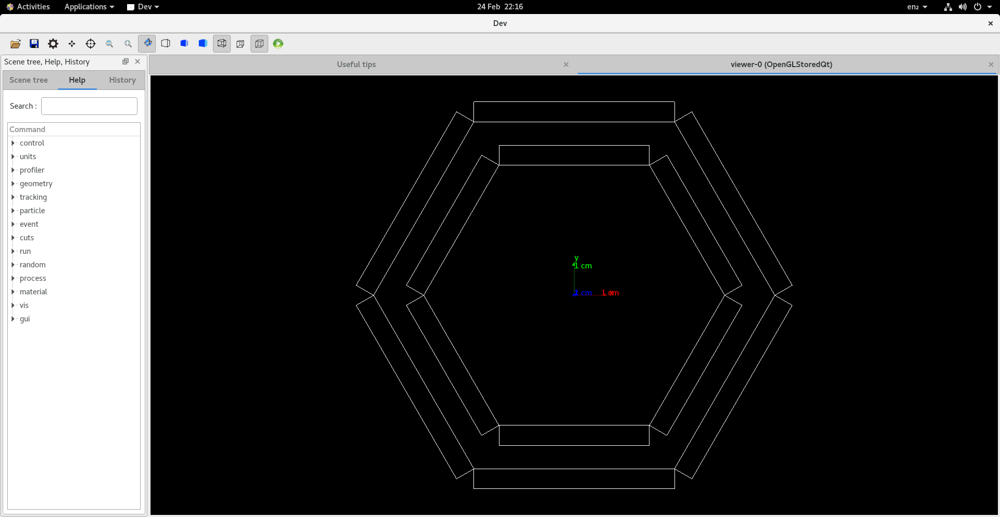

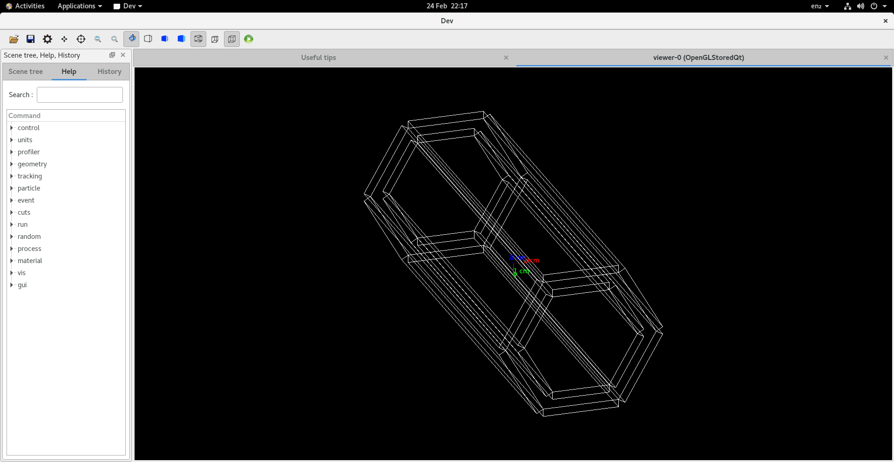

**The thickness was fixed and all 3 layers were added**

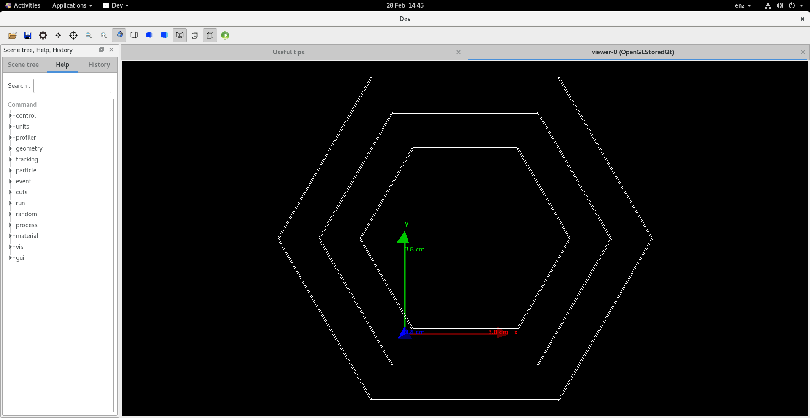

**Orientation was fixed and a scale was shown**

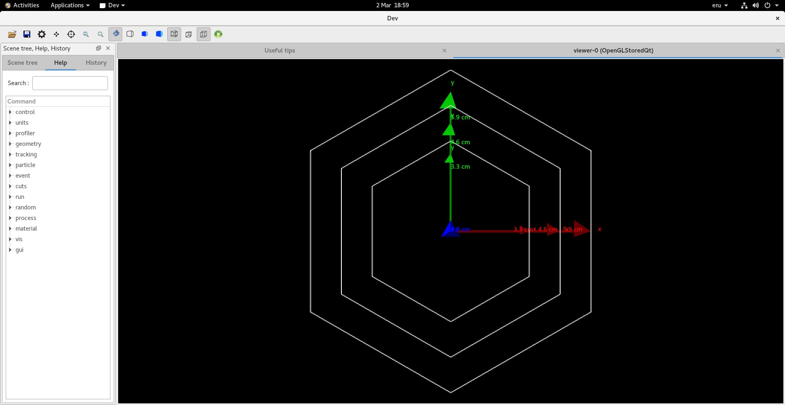

**Assembly volume was scrapped and mother volumes where used to create the HCI unit ontop of the cold plate**

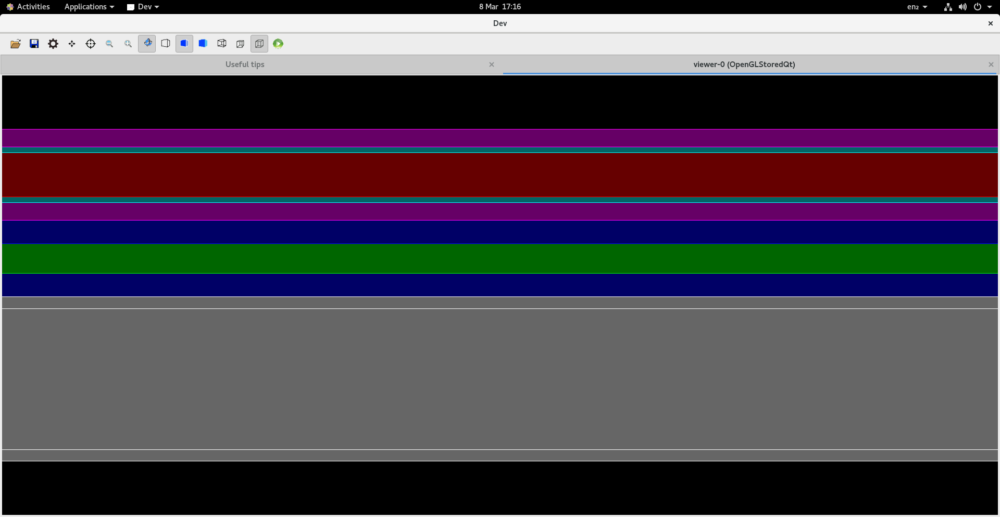

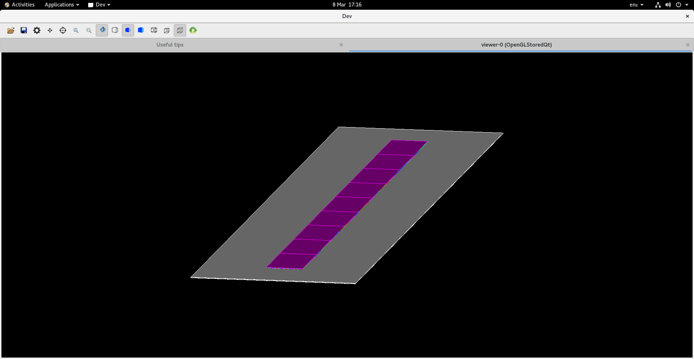

**Multiple, alternating HCI units were placed on the plate**

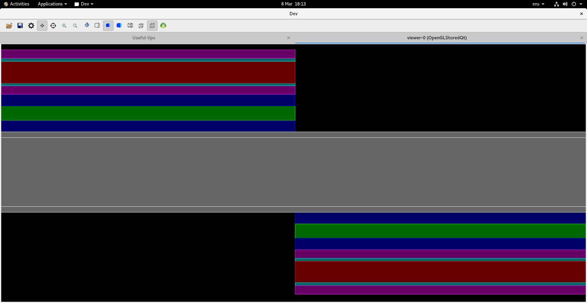

**Stave C was generated**

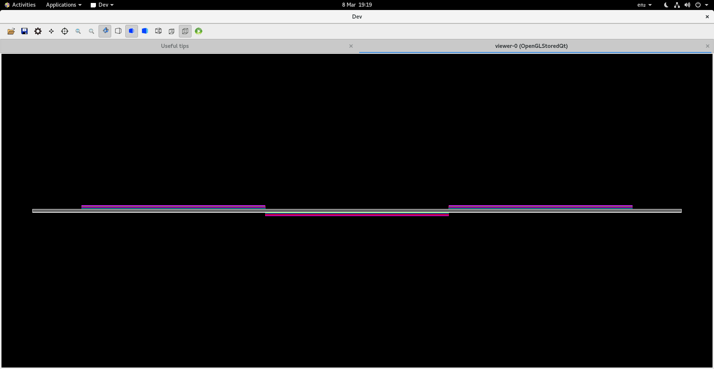

**All staves were added in the correct shape**

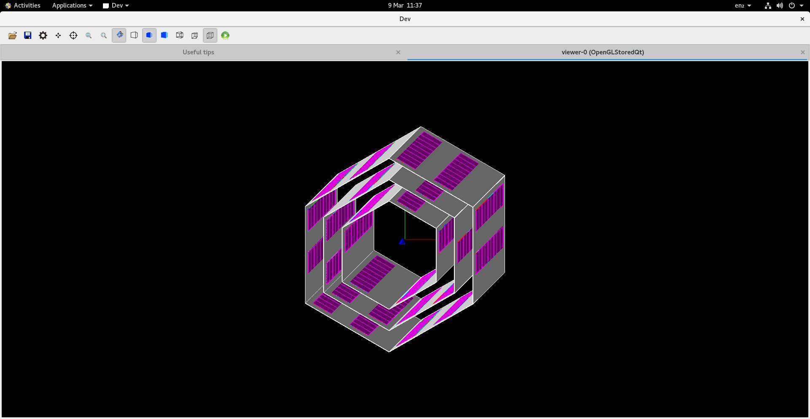

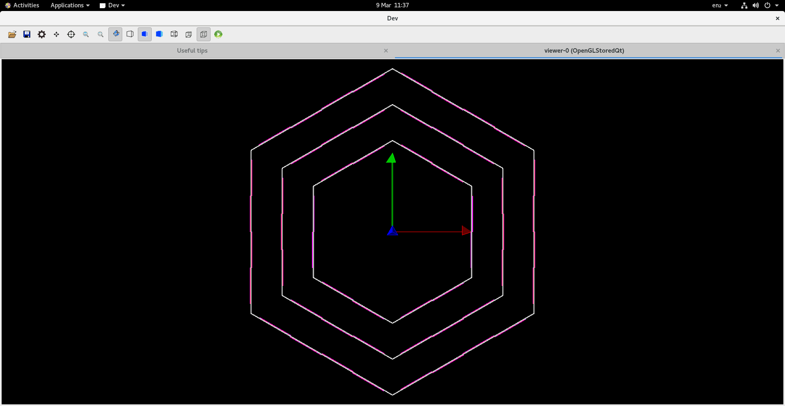

**Added sensitive detectors ("Chips" layers only)""

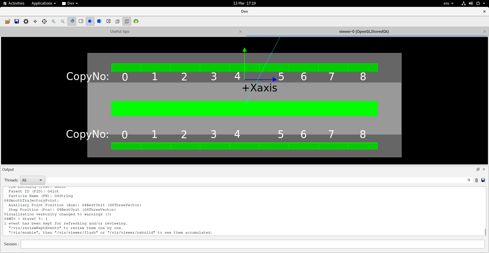

