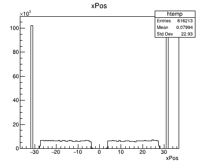
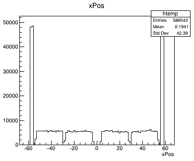
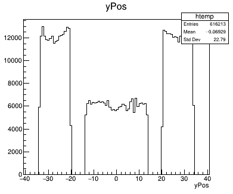
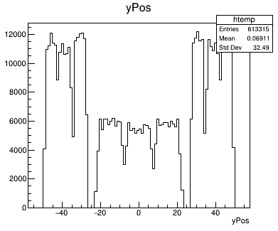
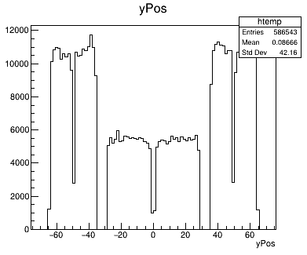
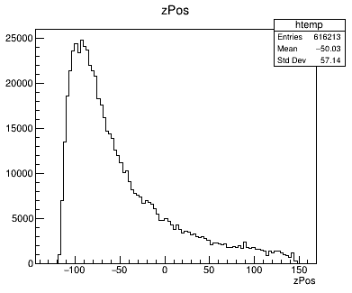
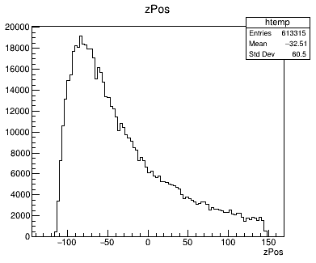
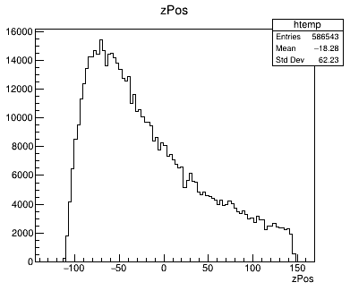

# Development Timeline

This will be a timeline to outline the development process.

Timeline section:

1. [Week 0-4](./Week0-4.md)
2. [Week 5-8](./Week5-8.md)

## 12/04/2023

### Recording measured position

The ability to record the digitised positions has been added and the first test has been done.

|Stave B| Stave C| Stave D|
|-------|--------|--------|
||||
||||
||||

