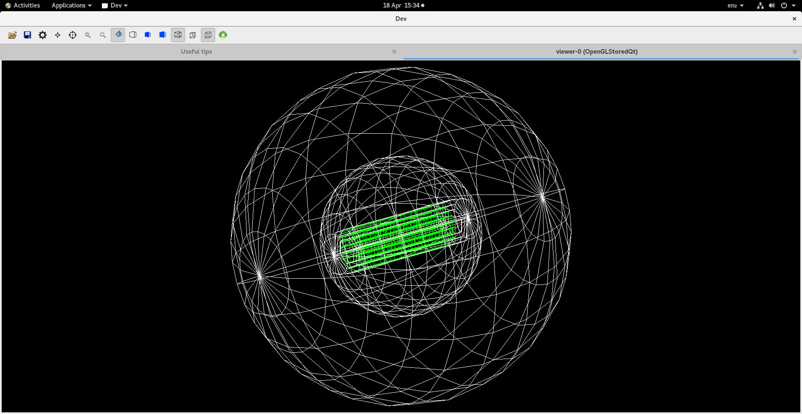
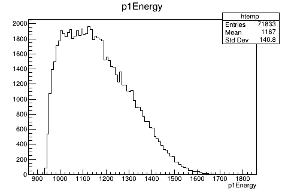
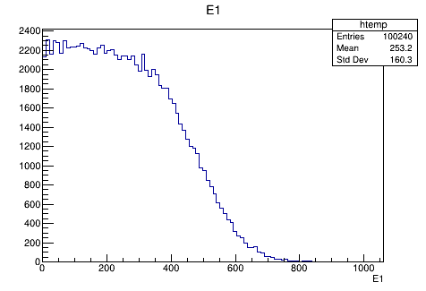
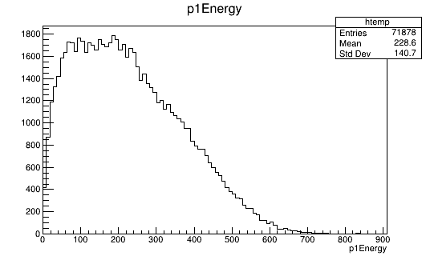
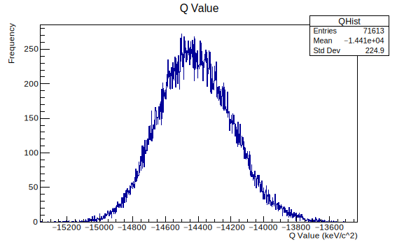
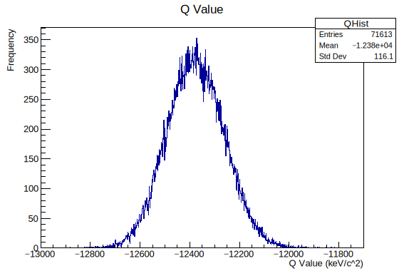
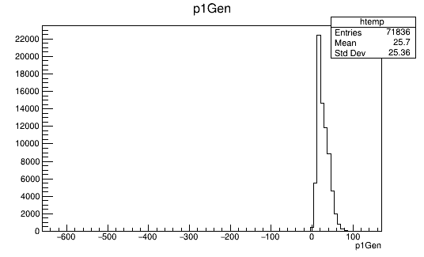
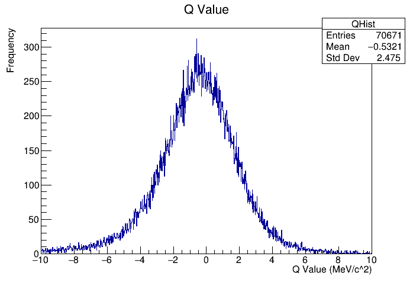
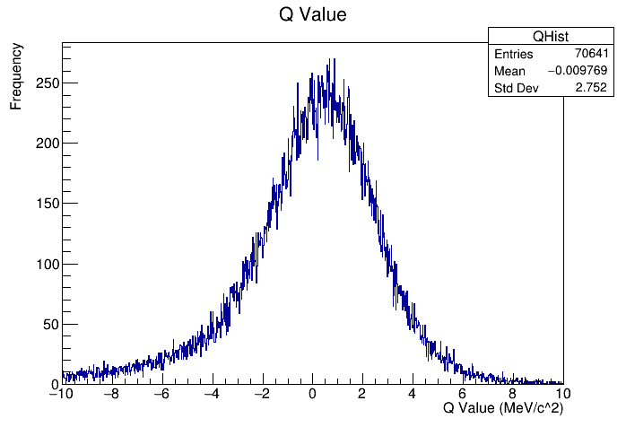
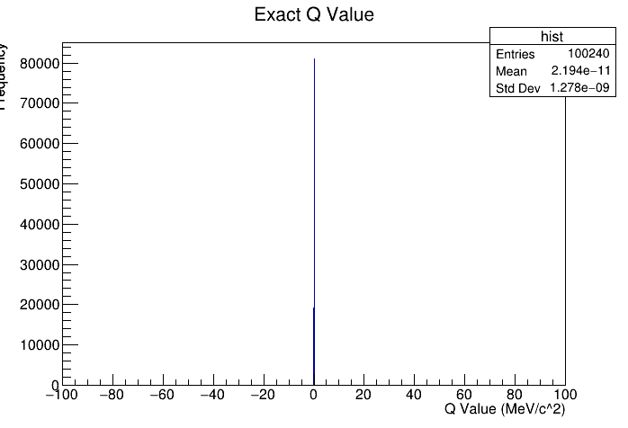

# Development Timeline

This will be a timeline to outline the development process.

Timeline section:

1. [Week 0-4](./Week0-4.md)
2. [Week 5-8](./Week5-8.md)

## 12/04/2023

### Recording measured position

The ability to record the digitised positions has been added and the first test has been done.

|Stave B| Stave C| Stave D|
|-------|--------|--------|
||||
||||
||||

X position data follows a trend. There are dinstinct blocks the represent the HIC units. The shallower blocks are due to the HIC units that are on the diagonal of the hexagon and have a seperation beween them due to the passive 1.2mm chip section not detecting particles. There is a gap in the centre due to the passive chip section as well as the padding on either side of the cold plate. Finally, the peaks at either side of the plot are due to the vertical HIC units since they will always give a similar x value compared to the HICs that are diagonal.

Y position data also follows a similar trend by showning different sections. The shallower sections represent the vertical HIC units since they will have the larger y spread. The taller sections are the diagonal sections that span a smaller y range. The gaps are also due to the passive chip sections similar to the x positions.

The Z position data shows a smoother curve. For staves further from the centre, the curve is stretched in the x axis direction, which makes sense since the solid angle spanned increases the further from the centre the stave is.

### Averaging firing pixels

Since adding the pixels to the geometry, a single particle can fire multiple pixels in a single HIC unit as it passes through. This means we can take the average value of all of the fired pixels to get the position of the particle with a better resolution. This calculation has been added.

THe resulting position data measured is very similar to that above (when not averaged) however, each distinct section has become slightly more convex in shape. Take the y positions in stave C

|Measured|Averaged|
|---|---|
|||

A few things to note in the averaged plot. I have split the data up by the incident particle in order to get a valid average value. Events where one of the particles did not hit a HIC unit are also discarded. Therefore, the number of entries has reduced by 90%. However, if all events were valid there would only be a maximum of 100240 entires, therefore, the total efficiency is sitting at around 60%.

### Averaging digitised error

I have also took this oppotunity to test how these values compare to the averaged exact value. There plots are very different compared to the original error plots.

|X|Y|Z|
|---|---|---|
||||

As shown, this has resulted in a much smoother plot without the tall peaks at the edges. One of the main differences is the fact that the x and y error look very similar, which was not the case before. Another difference is the fact that the z error seems to have reversed, and there is a gradual slope instead of the sharp peak seen before.

### New efficiency calculations

I fixed the issue with all events being invalid since multiple pixels are fired for each HIC unit. I fixed this by allowing more than 1 hit to also be called as a vlaid event. After running the experiment again the new efficiency values are:

Total valid: 32.13%

Good: 72.35%
Alright: 16.12%
Bad: 11.53%

This is a lot lower than I was expecting. However, there can be some explainable reasons for this. I have not ran an efficiency test since before the passive sections on the chips were added. And since the padding on the sides of the cold plates seemed to affect the efficiency a lot, it would not be suprising that these extra passive sections would also decrease the total performace. Another passive area was added after finding out that there was a small gap between HIC segments. This may have also effected the result.

I think I might need to return to the efficiency calculation to see if there is a way to make it more flexable. for istance, if particle 1 missed stave B but hit stave C and D, while particle 2 hit stave B and C, meaning their direction of travel can still be calculated but the current method would mean that this event was invalid. In essence, the current method looks at the staves individually and checks if they have been it by the particles. My new approach will be looking at the particles and checking if they hit at least 2 different staves.

### Adding new efficiency calculations

I have now changed the method of calculating the level of success of an event. Now, I will look at both particles and give them a level of success based on the layers they hit (while the particles are independent from eachother). After determining this, I get the overall outcome by taking the particle with the lowest level. E.g. if particle 1 had an alright event but particle 2 had a bad event, the overall level for the event would be bad. With this new method in place I ran an experiment and got these results:

Total: 33.90%

- Good: 72.85%
- Alright: 15.06%
- Bad: 12.09%

This did not increase the efficiency by much. I still think this method of calculating the efficiency is more accurate.

## 13/04/2023

### Oversight in efficiency

The efficiency results shown above are very low. It was brought to my attention that the reduction in active area would not justify a drop in efficiency by this much. After some investigation the issue was found to be the fact that the program runs using 2 seperate threads(workers) to speed up computation time.

Therefore, during one execution of the program, 2 seperate runs are happening. These runs therefore finish and outout their efficiency values, however, since there are only 100240 events to go around, each run will process roughly half of them, meaning the efficiency results stated above are that of a single thread. 

Fixing this meant that merging the results of each thread needed to be done. Here are the results:

Total valid: 67.87%

- Good: 72.77%
- Alright: 15.12%
- Bad: 12.11%

## 17/04/2023

### Geometry Generation Refactoring

As the project has progressed the code has become less modular and harder to modify in simple ways. For this reason I have refactored to code that generates the geometry.

## 18/04/2023

### Mylar Jacket

In the real detector, the liquid hydrogen target that will produce the particles must be kept in a container. The container that will be used is made of a material called "Mylar". I have added this to the geometry system. It was give a thickness of 100um but this can be changed.

### Reducing passive area

As a way to further increase the efficiency of the detector the passive area must be reduced. I have done this by overlapping the HIC units on either side of the plate in a way that the passive area created by the auxiliary chips is removed.


However, due to this overlapping the width of the stave is reduced in order to keep the padding on either side the same. Stave that have an odd number of HIC units result in a passive auxiliary chip to be on the outer side of the plate, I have taking this into account to keep the plate padding a constant for all stave layers.

|Normal padding|Modified padding
|---|---|
|||

As a result of this new plate width, the radius of the detector must also change to make sure all the plates are touching at the corners

|Stave|Old (mm)|New (mm)|
|---|---|---|
|B|33.03|29.24|
|C|46.02|41.19|
|D|59.00|53.14|

### Test results

Here is the difference in efficiency with the new layout

|Level of success|Old (%)|New (%)|
|---|---|---|
|Valid|67.87|71.68|
|Good|72.77|88.06|
|Alright|15.12|10.57|
|Bad|12.11|1.37|

### Adding CALIFA

In order to measure the energy of the particles, a calorimeter must be introduced. I have generated that geometry



- Inner diameter: 40cm
- Thickness: 44cm

### Experiment

After implementing the ability for the energy data recovered from the CALIFA to be recorded I carried out an experiment.

|Measured|Perfect|
|---|---|
|||

As seen, the measured values are very wrong considering that the perfect readings dont go higher than 800, while the measured reading start at this value. I know that the readings given from my program is in keV but more investigation is needed.

### Better results

In Geant, I am able to get a particles total energy or just the kinetic energy. Originally, I was getting the total energy. I have now change that to just get the kinetic energy the new results are:



These results are much closer to the original (they don't go above 800keV).

## 19/04/2023

### First Q value results

The script that calculates the Q value is now complete and I have been able to get a histogram of Q values, there are the results:



From my disseration project, I found that the missing mass calculated from the primary generator values produces a plot that shows slightly larger values (around -13300 at the centre).

### Error in value

I found a bug in the script that meant that the incorrect Q value was calculated. This has been fixed and here are the results:



### Varification of energy values

After doing some sanity checks comparing the measured energy to the actual energy of the protons there have been some discoveries. Consider these comparisons:

```cmd
100233|152.512,82.2573 : 279.303,194.81 (126.792,112.553)
100234|360.02,79.3748 : 152.492,207.374 (-207.528,127.999)
100235|188.304,265.554 : 218.816,231.639 (30.5126,-33.9142)
100236|259.255,120.591 : 14.9842,429.228 (-244.271,308.637)
100239|371.045,211.776 : 356.709,142.713 (-14.3362,-69.0632)
```

The first number is the event ID, the next 2 numbers are the measured energies, the next 2 numbers are the respective actual values, and finally, the last 2 numbers is the difference between them.

The first thing to notice is that the difference for some of the readings is negative, meaning that the simulation recorded a higher energy than the particle started with. This implies that there is an error somewhere. The expected difference in values should be between 0.4-0.8.

### Pinpointing issue

The issue is NOT within the simluation, I have directly pulled the initial energy values and their respective measured energies from the simluation, then did the same for the Q value script and found that the initial values are not matching up:

Event 1000126

|Particle|Initial Simluation (MeV)|Initial Script (MeV)|Measured (MeV)|
|---|---|---|---|
|1|69.0623|18.5151|55.6619|
|2|438.32|292.644|376.98|

Therefore, the issue is with the script.

## 25/04/2023

### Energy loss function

While trying to fix the mismatch in the exact energy value and the measured energy values, I decided to simply record the exact energy values into the root file as the measured values during the simluation. This has somewhat fixed the issue and **most** of the values line up. However, there are still sometimes impossible negative differences. This is shown below in a histogram containing all the values for the differences in energy during the simluation. The small number of negative values is causing the x-range to be extended in the negative direction.



This indicates there is an issue in the part of the simluation that reads the energy value in through the generator root file. 

### Fixing energy loss

I fixed the energy loss by writing the data to the file at an earlier stage.

### Energy loss

In the primary generator there are 2 different angles the initial particles are given. This is because they are in 3D space.

The first angle is **theta**, this is the angle from the z axis (about the x axis) the particle will be. This angle is only between $0 \rightarrow \approx 1.4 \text{rads}$. This makes sense since the particles will have some forward momentum due to the direction of the initial beam. The other angle is **phi**, this is the angle from the x axis (about the z axis) that the particles will be shot. This angle ranges from $-\pi \rightarrow /pi$, which also makes sense since the particles can be shot anywhere within a cone area pointing in the +z direction.

|Theta|Phi|
|---|---|
|||

There is a pattern to be seen in the theta angle. The pattern being that the shallower the angle, the more energy is lost. This makes sense since the shallower the angle, the more time the particles are traveling through the materal. 

It is interesting to see the gaps in the Phi plot. These are due to the padding at the edges of the hexagon detectors. Therefore, no particles are detected if they are shot at that angle. 

### Fitting to the plot

In order to use this information to estimate the energy loss by the particle, a function must be fit on the plot. To me, this plot looks like a stright line would be a good fit. Therefore, I have fit that line and got the following:


As can be seen, the gradient of the line is -464.6, while the y intercept is 582.2. The largest loss of energy is roughtly 800-900 MeV, which seems a bit high. This would make more sense if the units were in keV, however.

## 26/04/2023

### Mistakes in plot

It turns out that the data that was being plotted was simply the kinetic energy of the particles rather than the energy loss. After fixing this issue I found that the problem with large negative values persists. However, it seems like all the incorrect energy values come from particles that are emitted at a large angle and therefore, have smaller starting kinetic energies.


After printing out all the events that gave negative values, the smaller energies can be seen.

```cmd
19.5115 - 451.886 = -432.374
19.5816 - 243.937 = -224.355
23.2865 - 265.273 = -241.986
23.5332 - 239.299 = -215.766
19.6914 - 106.163 = -86.4713
22.2647 - 201.467 = -179.202
21.8534 - 256.736 = -234.883
22.0448 - 476.068 = -454.023
23.5674 - 38.1439 = -14.5764
22.5094 - 232.823 = -210.313
21.3801 - 64.6005 = -43.2205
21.4124 - 56.1836 = -34.7712
20.4309 - 122.025 = -101.594
23.9683 - 436.687 = -412.718
20.2897 - 59.8048 = -39.5151
21.4684 - 404.024 = -382.556
22.4751 - 285.455 = -262.98
```

### Potential fix

The issue that was occuring was the fact that some events would be classed as valid since both particles hit at least 2 layers. However, some of the time, those particles would not hit the califa. This meant that the energy reading given was the energy of the last particle that hit the CALIFA. I fixed this by only classing an event as valid if both particles hit at least 2 layers and both particle also hit the CALIFA. Since this was a very rare occurance, the effect on efficiency was very small.

Here are the new results:


Though this is the energy loss instead of the kinetic energy, the actual values still seem quite high compared to the few hundred keV that should have been expected.

### Further investigation


I decided to look at the energy loss realted to the Phi angle. It seems, just like the theta plot, that most particles have an energy loss close to 20MeV. It also seems that with the theta plot, as the angle gets shallower more particles have less than this 20MeV cutoff.

### Fitting

A found that a cubic fits onto the plot relativly well since it also takes into account the increased number of particles with smaller energy loss with shallower angle.


### Energy loss magntiude

After some discussion, one of the reasons that the energy loss rate is much higher than expected could be due to the particles traveling some distance into CALIFA before the kinetic energy is taken, therefore, allowing for energy to be lost and inflating the energy loss rate value.

This was changed by using the PreStepPoint rather than the Track. Here are the results:


Note that the fitted line on this plot is a quadratic rather than a cubic. It can be seen that the energy loss rate has dropped, to a much more sensible value. This fitting line has the equation:

$$
E_{loss} = 15.5458\theta^2 - 18.0095\theta + 7.72777
$$

### Applying energy loss

The next step is to take the energy that the CALIFA measures, calculate the approximate energy loss given by the above function and add that onto the measured value. This should somewhat counteract the energy lost in the layers of the detector. 

I have done this in the script that calculates the Q value. However, there seems to be little change:

Original mean Q: -12330 keV/c^2
New mean Q: -12320 keV/c^2

This is not correct and something must be incorrect. Further investigation is needed.

## 27/04/2023

### Finding errors in Q value

The first issue with the Q value is the fact that it is actaully given in MeV/c^2, not keV/c^2.  Therefore, the given values are actaully extremely high. 

The next issue I solved was the fact that when calculating the 4-momentum vectors, the energy componant of that was the kinetic energy. However, this value should have been the total energy. This has been fixed and not the correct 4-momentum vectors are being calculated. 

Finally, the energy value used for the beam 4-momentum was given as 500MeV. However, this is the energy of a single atom in the beam nucleus. In reality, there are 12 atoms so this 500MeV must be multipled by 12.

After doing all this correcting, the new Q values are given to be quite close to 0, which is also not what I would have expected.

## 02/05/2023

### Finding the issue

After further investigation not much progress is being made. Below is the current q value results that are being generated.



### Without energy correction

I removed the energy correction and got the following result:



As seen, the correction only changes the mean Q value by around 0.5MeV. Therefore, this is not what is cuasing the issue.

### More confusion

As a sanity check, I wrote a script that would output the exact Q value data from the data used for the primary generator of the simulation. However, I have found that doing this results in the invarient mass of the 4-momentum vectors, `(targetMomentum + beamMomentum) - (proton1Momentum + proton2Momentum)` is exactly the same as the mass of the fragment. Therefore, the Q value comes out as 0 for all of the data.

The script is below:

```cpp
//Beam 4-momentum
const double beamM = MA;
const double beamEk = ENERGY * A;
const double beamP = momentum(beamEk,beamM);
const double beamE = totalEnergy(beamP,beamM);
auto lBeam = TLorentzVector(0,0,beamP,beamE);

//Target proton 4-momentum
const double targetM = Ma;
auto lTarget = TLorentzVector(0,0,0,targetM);

//Initial system 4-momentum
auto momIn = lTarget + lBeam;

//Reads each row of tree
while (reader.Next()) {
	//Proton 1 4-momentum
	auto p1 = TVector3(*P1x,*P1y,*P1z);
	auto e1 = totalEnergy(p1.Mag(),Ma);
	auto lP1 = TLorentzVector(p1,e1);

	//Proton 2 momentum
	auto p2 = TVector3(*P2x,*P2y,*P2z);
	auto e2 = totalEnergy(p2.Mag(),Ma);
	auto lP2 = TLorentzVector(p2,e2);

	//Final system 4-momentum  (excluding fragment)
	auto momOut = lP1 + lP2;

	//Difference of start and final 4-momentum
	auto missing = momIn - momOut;

	//Q value
	auto qValue = missing.M()-MB; //THESE VALUES ARE THE SAME!!
	std::cout<<qValue<<std::endl;
	hist->Fill(qValue);
}
```

Where the momentum and energy functions are as follows:

```cpp
/*Calculates the relativistic momentum from the particle mass and kinetic energy*/
double momentum(double energy, const double mass){
	return std::sqrt((energy*energy)+(2*energy*mass));
}

/*Calculates a particles total energy from its momentum and mass*/
double totalEnergy(double momentum,const double mass) {
	return std::sqrt((mass*mass) + (momentum*momentum));
}
```

I cannot see any issues with this code apart from the outputting results. This is leading me to think that there might be something wrong with the event generator itself.

However, if this is the case, and the generator actually gives a Q value of 0, then my script calculating the Q value from the measured values may be correct, since it has a mean around 0 when the energy correction was **NOT** applied, shown [here](#without-energy-correction)

## 03/05/2023

### Failed changes

Though it should not make a difference, instead of just subtrating the mass of the fragment at the end of the calculations, I calculated to 4-momentum vector of the fragment and added that to the final 4-momentum vector. As expected, this gave the same results as the old method.



### Final script investigation

After a lot of further testing and tweaking I have come to the conclusion that my script is working as intended, but the data in the primary generator may be wrong. 

To see if this is the case, I will try and generate a new set of data and redo the entire calculation using that.


