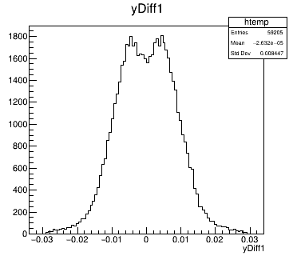

# Development Timeline

This will be a timeline to outline the development process.

Timeline section:

1. [Week 0-4](./Week0-4.md)
2. [Week 5-8](./Week5-8.md)
3. [Week 9-12](./Week9-12.md)

## 23/05/2023

### Modifying detector shape

A new octagonal detector is going to be tested. Even though this design will increase the amount of passive area, the CALIFA will have passive area that follows an octagon.

This is the new detector shape as for now:


### Adding offset

To make the system match more closley to the plans, I have added an small angular offset to the entire detector. Here is the new orientation:


### New radii

After adding more staves, this means that the radii of the layers must also change since the number of HICs remains the same. The new lengths are as follows:

|Stave|Old(mm)|New(mm)|
|---|---|---|
|B|29.24|40.70|
|C|41.19|57.36|
|D|53.14|74.01|

This is a 39% increase for each layer. The radii of the system can be changed by changing the number of HICs on each layer.

### First test

I have ran the first test to see the distribution of the particles that it could detect. There are some significant changes. 

The first difference is the x and y values that it can record:

|Octagon|Hexagon|
|---|---|
|||
|||

Unlike the hexagon configuration, this pattern was the same for all layers (2,3, or 4 HICs per stave). The z plot was very similar.

The next difference, which I think is a not as intended and should be investigated is with the error in the position measurements in the first place

|Octagon|Hexagon|
|---|---|
|||
|||
|||

The error in the z direction seems to be pretty much unchaged, while the x and y directions have a few much larger errors. I want to reduce these outlier errors as much as possible. It must have something to do with the method that is being used to get the points of the pixels via the volume tree. This will be investigated.

Finally, as expected, the final efficiency has also reduced. This is because with more staves means more padding area and dead space.

|Level of success|Old(%)|New(%)|
|---|---|---|
|Valid|71.68|67.34|
|Good|88.06|87.55|
|Alright|10.57|11.19|
|Bad|1.37|1.26|

## Error reduced

When calculating the orientation of the pixel that was hit, the angle must be negated if the pixel is on a stave that is past the x = 0 line. The staves are numbered from 0 (right most stave), and counts anti-clockwise, as described in [Week 5-8](./Week5-8.md). Therefore, for the hexagon, this condition would be:

```cpp
//Rotation must negate if the stave is on the left side
if (stave >= 2 && stave <= 4)
	rot -= tempRot;
else
	rot += tempRot;
```

While the octagon adds some extra staves, therefore, the new condition is:

```cpp
//Rotation must negate if the stave is on the left side
if (stave >= 2 && stave <= 5)
	rot -= tempRot;
else
	rot += tempRot;
```

After changing this condition the positional errors returned to as they were before changing the geometry.

