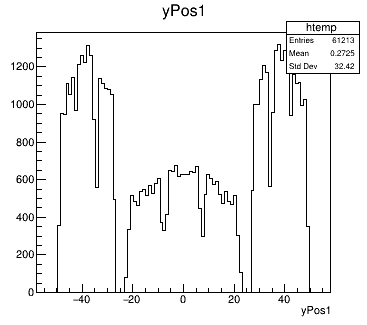
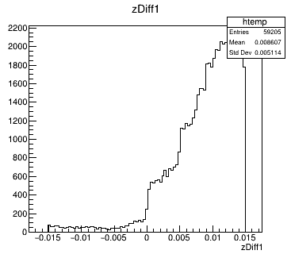

# Development Timeline

This will be a timeline to outline the development process.

Timeline section:

1. [Week 0-4](./Week0-4.md)
2. [Week 5-8](./Week5-8.md)

## 12/04/2023

### Recording measured position

The ability to record the digitised positions has been added and the first test has been done.

|Stave B| Stave C| Stave D|
|-------|--------|--------|
||||
||||
||||

X position data follows a trend. There are dinstinct blocks the represent the HIC units. The shallower blocks are due to the HIC units that are on the diagonal of the hexagon and have a seperation beween them due to the passive 1.2mm chip section not detecting particles. There is a gap in the centre due to the passive chip section as well as the padding on either side of the cold plate. Finally, the peaks at either side of the plot are due to the vertical HIC units since they will always give a similar x value compared to the HICs that are diagonal.

Y position data also follows a similar trend by showning different sections. The shallower sections represent the vertical HIC units since they will have the larger y spread. The taller sections are the diagonal sections that span a smaller y range. The gaps are also due to the passive chip sections similar to the x positions.

The Z position data shows a smoother curve. For staves further from the centre, the curve is stretched in the x axis direction, which makes sense since the solid angle spanned increases the further from the centre the stave is.

### Averaging firing pixels

Since adding the pixels to the geometry, a single particle can fire multiple pixels in a single HIC unit as it passes through. This means we can take the average value of all of the fired pixels to get the position of the particle with a better resolution. This calculation has been added.

THe resulting position data measured is very similar to that above (when not averaged) however, each distinct section has become slightly more convex in shape. Take the y positions in stave C

|Measured|Averaged|
|---|---|
|||

A few things to note in the averaged plot. I have split the data up by the incident particle in order to get a valid average value. Events where one of the particles did not hit a HIC unit are also discarded. Therefore, the number of entries has reduced by 90%. However, if all events were valid there would only be a maximum of 100240 entires, therefore, the total efficiency is sitting at around 60%.

### Averaging digitised error

I have also took this oppotunity to test how these values compare to the averaged exact value. There plots are very different compared to the original error plots.

|X|Y|Z|
|---|---|---|
||||

As shown, this has resulted in a much smoother plot without the tall peaks at the edges. One of the main differences is the fact that the x and y error look very similar, which was not the case before. Another difference is the fact that the z error seems to have reversed, and there is a gradual slope instead of the sharp peak seen before.

### New efficiency calculations

I fixed the issue with all events being invalid since multiple pixels are fired for each HIC unit. I fixed this by allowing more than 1 hit to also be called as a vlaid event. After running the experiment again the new efficiency values are:

Total valid: 32.13%

Good: 72.35%
Alright: 16.12%
Bad: 11.53%

This is a lot lower than I was expecting. However, there can be some explainable reasons for this. I have not ran an efficiency test since before the passive sections on the chips were added. And since the padding on the sides of the cold plates seemed to affect the efficiency a lot, it would not be suprising that these extra passive sections would also decrease the total performace. Another passive area was added after finding out that there was a small gap between HIC segments. This may have also effected the result.

I think I might need to return to the efficiency calculation to see if there is a way to make it more flexable. for istance, if particle 1 missed stave B but hit stave C and D, while particle 2 hit stave B and C, meaning their direction of travel can still be calculated but the current method would mean that this event was invalid. In essence, the current method looks at the staves individually and checks if they have been it by the particles. My new approach will be looking at the particles and checking if they hit at least 2 different staves.

### Adding new efficiency calculations

I have now changed the method of calculating the level of success of an event. Now, I will look at both particles and give them a level of success based on the layers they hit (while the particles are independent from eachother). After determining this, I get the overall outcome by taking the particle with the lowest level. E.g. if particle 1 had an alright event but particle 2 had a bad event, the overall level for the event would be bad. With this new method in place I ran an experiment and got these results:

Total: 33.90%

- Good: 72.85%
- Alright: 15.06%
- Bad: 12.09%

This did not increase the efficiency by much. I still think this method of calculating the efficiency is more accurate.

## 13/04/2023

### Oversight in efficiency

The efficiency results shown above are very low. It was brought to my attention that the reduction in active area would not justify a drop in efficiency by this much. After some investigation the issue was found to be the fact that the program runs using 2 seperate threads(workers) to speed up computation time.

Therefore, during one execution of the program, 2 seperate runs are happening. These runs therefore finish and outout their efficiency values, however, since there are only 100240 events to go around, each run will process roughly half of them, meaning the efficiency results stated above are that of a single thread. 

Fixing this meant that merging the results of each thread needed to be done. Here are the results:

Total valid: 67.87%

- Good: 72.77%
- Alright: 15.12%
- Bad: 12.11%

## 17/04/2023

### Geometry Generation Refactoring

As the project has progressed the code has become less modular and harder to modify in simple ways. For this reason I have refactored to code that generates the geometry.

## 18/04/2023

### Mylar Jacket

In the real detector, the liquid hydrogen target that will produce the particles must be kept in a container. The container that will be used is made of a material called "Mylar". I have added this to the geometry system. It was give a thickness of 100um but this can be changed.

### Reducing passive area

As a way to further increase the efficiency of the detector the passive area must be reduced. I have done this by overlapping the HIC units on either side of the plate in a way that the passive area created by the auxiliary chips is removed.

However, due to this overlapping the width of the stave is reduced in order to keep the padding on either side the same. Stave that have an odd number of HIC units result in a passive auxiliary chip to be on the outer side of the plate, I have taking this into account to keep the plate padding a constant for all stave layers.

|Normal padding|Modified padding
|---|---|
|||

As a result of this new plate width, the radius of the detector must also change to make sure all the plates are touching at the corners

|Stave|Old (mm)|New (mm)|
|---|---|---|
|B|33.03|29.24|
|C|46.02|41.19|
|D|59.00|53.14|

### Test results

Here is the difference in efficiency with the new layout

|Level of success|Old (%)|New (%)|
|---|---|---|
|Valid|67.87|71.68|
|Good|72.77|88.06|
|Alright|15.12|10.57|
|Bad|12.11|1.37|

