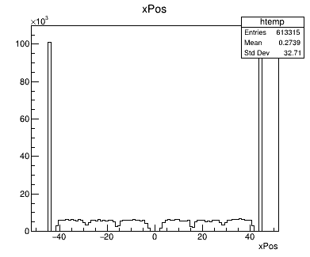

# Development Timeline

This will be a timeline to outline the development process.

Timeline section:

1. [Week 0-4](./Week0-4.md)
2. [Week 5-8](./Week5-8.md)

## 12/04/2023

### Recording measured position

The ability to record the digitised positions has been added and the first test has been done.

|Stave B| Stave C| Stave D|
|-------|--------|--------|
||||
||||
||||

X position data follows a trend. There are dinstinct blocks the represent the HIC units. The shallower blocks are due to the HIC units that are on the diagonal of the hexagon and have a seperation beween them due to the passive 1.2mm chip section not detecting particles. There is a gap in the centre due to the passive chip section as well as the padding on either side of the cold plate. Finally, the peaks at either side of the plot are due to the vertical HIC units since they will always give a similar x value compared to the HICs that are diagonal.

Y position data also follows a similar trend by showning different sections. The shallower sections represent the vertical HIC units since they will have the larger y spread. The taller sections are the diagonal sections that span a smaller y range. The gaps are also due to the passive chip sections similar to the x positions.

The Z position data shows a smoother curve. For staves further from the centre, the curve is stretched in the x axis direction, which makes sense since the solid angle spanned increases the further from the centre the stave is.

