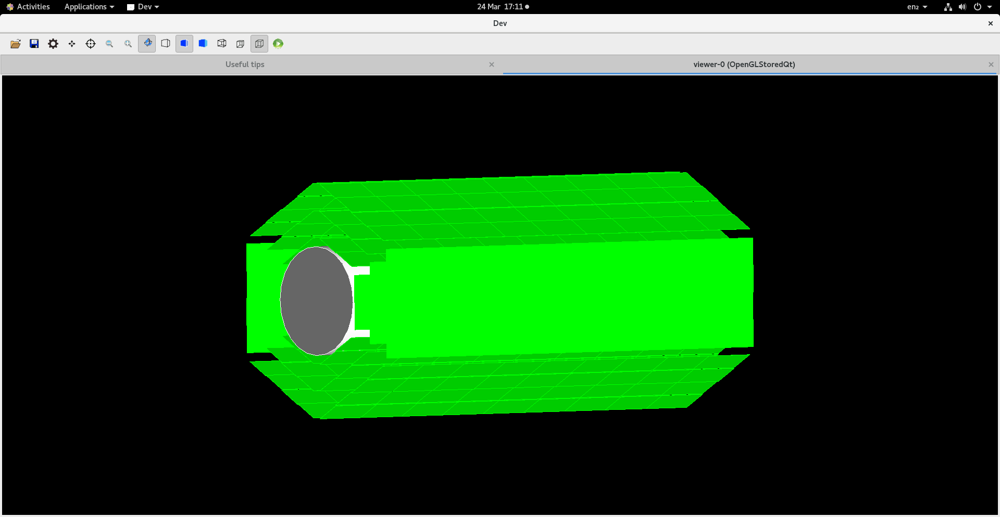
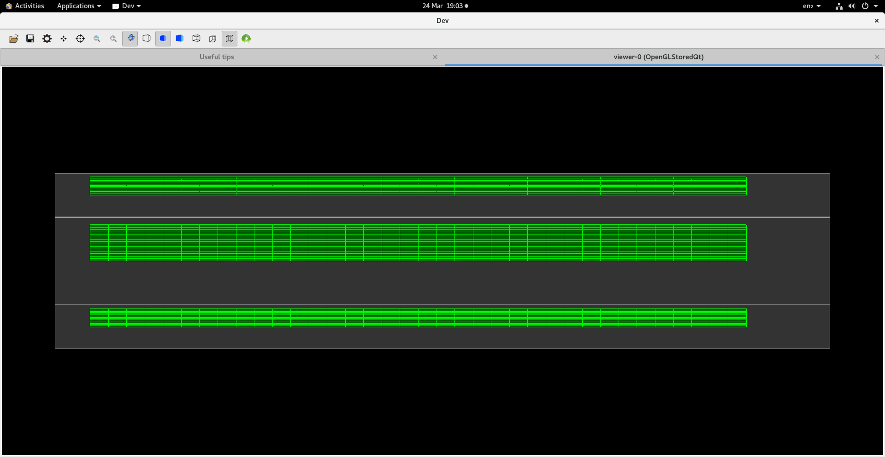

# Development Timeline

This will be a timeline desplaying screenshots taken to outline the development process.

## The cold plates were initially generated using an assembly volume.


## The thickness was fixed and all 3 layers were added


## Orientation was fixed and a scale was shown


## Assembly volume was scrapped and mother volumes where used to create the HCI unit ontop of the cold plate


## Multiple, alternating HCI units were placed on the plate


## Stave C was generated


## All staves were added in the correct shape


## Added sensitive detectors ("Chips" layers only)


## NOTE the printout showing each layers is distinct from eachother


## Implimented the ability for the program to count the number of hits on each sensitive detector throughout the run and calculate the efficiency


However, sometimes a secondary particle is generated and scatters multiple times within the sensitive detectors, causing multiple counts. Notice the count of 15 hits on the stave C layer. 


## First efficiency outcome

After a full run simply counting the number of particles that hit each layer without taking scattering, or secondary particles into account the efficiency was calculated. A 100% efficiency would mean the layer has been hit 200480 times since there are 2 particles generated for each of the 100240 events.

|Layer     |Hits   |Efficiency|
 ------- | ----- | -------- 
D (4 HCIs)|139,147|69.4%
C (3 HCIs)|151,834|75.7%
B (2 HCIs)|153,856|76.7%


After adding a stacking action to delete all particles except the initial protons (removing secondary particles so they arent counted if they hit the detector multiple times as shown above) the efficiency changes.

|Layer     |Hits   |Efficiency|
 ------- | ----- | -------- 
D (4 HCIs)|133,279|66.5%
C (3 HCIs)|144,275|72.0%
B (2 HCIs)|148,442|74.0%


This makes sense because the number of hits isn't being inflated by the extra hits by electrons. Though, there is still the issue of the original protons scattering and hitting the detector multiple times.

## Getting total system efficiency

To get the total efficiency, what constitutes a valid and invalid event must be defined rather than just counting the number of hits on each detector. If either particle misses more than 1 layer the whole event is invalid. However, since there are 3 layers, there are different levels of success for each valid event. These levels were defined the experiment was run to calculate the total efficiency of the system.

 - Total Efficiency: 51.9%
 
|Level of Success|Definition|Percentage of Valid Events|
|---|---|---|
|Good|C + B _or_ C + B + D|90.4%|
|Alright|C + D|8.7%|
|Bad|B + D|0.9%|

## 21/3/2023
### Material definitions

At this point the materials used have been placeholders. Each layer was made up of carbon, while the empty space was a vaccum. Trying to make the simluation closer to the correct materials, I have modifed them

```cpp
void DevDetectorConstruction::DefineMaterials(){
	//Defining materials
	G4NistManager* pNist = G4NistManager::Instance();
	G4Material* C = pNist->FindOrBuildMaterial("G4_C");
	G4Material* Si = pNist->FindOrBuildMaterial("G4_Si");
	G4Material* Al = pNist->FindOrBuildMaterial("G4_Al");
	G4Material* kapton = pNist->FindOrBuildMaterial("G4_KAPTON");

	//Defining volume materials
	pWorldMat = pNist->FindOrBuildMaterial("G4_Galactic");
	pPlateMat = C;
	pFleeceMat = C;
	pGlue = C;
	pChips = Si;
	pSolder = C;
	pConducting = Al;
	pSubstrate = kapton;
}
```
Now, the only material that is not correct is `pSolder`. This is an epoxy chemical compound, $C_2H_2$.

After running the experiments again, the efficiency is pretty much the same. This was expected as the thickness of the materials is smaller and the energy of the protons are high so complete absorbtion is unlikely to occur.

### Improving efficiency by moving HCI unit

When trying to increase the efficiency of the system, one method to do this is to increase the solid angle swept by the detector plates. There are a few ways to do this.

The first is to move the HCI unit forward away from the origin of the particles. This means the units will cover more of the cone in which the 
particles can move. 


These are the results:


### Imporoving efficiency by chaning the amount of padding by the cold plate

For the same reasons, the padding on either side of the HCI unit can also be reduced to lower the space between the detectors that the particles can pass through.


The results show that the efficiency was greatly increased if the padding was non-existent (~80%). However, this may become an issue when building the physical detector.  

### Improving efficiency by moving the particle origin point

For the same reason as the changes above, the particle source can be moved to the end of the detector. This means that the entire HCI unit will be used. Before this change (particle are generated from the centre), half of the unit was never hit because the particles will always be travelling forward when they are generated.


I carried out an experiment with these parameters:

- Particles are generated 10mm from the back of the detector
- The HCI units are shifted 10mm towards to front of the detector
- There is 3mm of padding on wither side of the cold plates

Here are the results:

- Total Efficiency: 66.7%%
 
|Level of Success|Percentage of Valid Events|
|---|---|
|Good|70.2%|
|Alright|29.0%|
|Bad|0.8%|

Though the total efficiency has increased, the proportion of those that are considered _Good_ is reduced. This makes sense since the particles that are now captured after moving the origin back will be those that are travelling at a shallower angle. Therefore, there is a higher chance of missing the last layer, resulting in a _Alright_ event.

## 23/03/2023
### Testing affect of padding on efficiency if particle source is pushed down the detector

To keep my testing consistent and as close to the main simulation as possible, I have changed the position of the particle source to be where the effective area of the detector starts, e.g. Not at the very end of the detector, but at the point where all the HCI units begin. 

I then carried out the experiment changing the amount of padding and here are the results:


These results show that with no padding at all, the system could be more than 90% efficient. However, this may be impractiacal. The accpeted efficiency is 70% or higher. This is the case when the padding is at most 3.5mm.

To get a better view on the levels of success, a final test was done where the padding was set to 3mm in order to get the efficiency above 70%. Here are the results:

- Total Efficiency: 73.6%
 
|Level of Success|Percentage of Valid Events|
|---|---|
|Good|89.4%|
|Alright|9.4%|
|Bad|1.2%|

## 24/03/2023
### Adding Liquid Hydrogren target

In the real detector, the protons will be produced by aiming a particle beam at a liquid hydrogen target. This was added at the over the top of where the particles are generated.

The target as a diameter of 3cm and a length of 3cm.




### Starting to digitize

The next goal is to set up digitisation in order to gather results that are more realistic to what the detector would output. To do this I have added the ability to split the Individual HCI segments into smaller pixel sections.

In the real simulation the pixels will be 30x30 $\mu m^2$. In the image below is not to scale and is just for ease of viewing.



## 27/03/2023
### HIC Unit seperation

Due to physical constraints, the individual HIC segments cannot be touching and have a 0.2m gap inbetween each one. I have added this feature into the HICs. Another feature that will be present in the real detector is the addition of a passive periphery circuit along the bottom of the unit that is 1.2mm wide. 


The actual chips going to be used will be the [ALPIDE chips](https://indico.cern.ch/event/863068/contributions/3752479/attachments/1996261/3330551/20200302-Aglieri-ALPIDE-Overview.pdf).

These chips have a resolution of 512x1024 and are 15mmx30mm. An attempt will be made to get our model as close to this as possible.

## 28/03/2023
### Fixing Target

It was brought to my attention that the target had the wrong dimensions. The new target as a radius of 3cm and a length of 1cm


### Attempt to make detector unit

I set up a parameterisation to define the pixels and the passive circuit board into the HIC unit. However, whole trying to generate a single 15mmx30mm, the entirty of my 16GB of RAM was used up. Therefore, this method is not usable in a practical sense.

### Second Attempt to make detector unit

The more memory efficient approach was to use the PVReplica class twice to make a grid of pixels. This method allows me to run the program, though the visualiser takes much longer to start up. However, due to the large number of pixels, it is not practical to render each one, since the visualiser lags. Therefore, only the 9 segments will be visualised.

### Creating chip active area

Due to the way the replica class works, I must first generate the active area of the chips and add the passive circuit board with another set of replicas. 

First, I have made the active area the correct size, so that it can contain 460x1000 px.


### Creating chip passive area

I have now generated the passive chip area along the side of each chip, shown in the dark green.


### Testing with pixel array

After running a single test, I found that not a single event was classed as valid. This is because, a valid event was determined by each particle coming into contact with a single senstive detector of each layer, e.g. each layer picks up 2 detections. However, since adding the pixels, each particle is passing through multiple pixels on each layer, therefore, making the event invalid.

For example, the last event of the simluation shows the following pixels within stave C hit:

```cmd
G4WT0 > StaveC: 8 (490,491,492,308,309,310,310,311)
```

8 different pixels were hit by the particles. Though the pixels are clise together indicated by their similar copy numbers.

I think I am going to try and set up the digitisation before fixing this bug. I think this can be fixed easily by just considering the first pixel hit by each particle at each layer.

## 30/03/2023

### Digitisation problem

When trying to digitise the detector, the goal it to find out which pixel the particle hit, then find the position the centre of that particle. When setting up the geometry, different parts of the detector are given copy numbers. These copy numbers are the way of identifying which part of the sensitive detector was hit. 

An overview on how the copy numbers are set up are below,

#### Each stave is given a number


#### Each HCI strip is given a number, relative to the stave it is on

The range of these numbers depend on the layer e.g. stave D contains 4 strips so they will be numbered between 0 -> 3.


#### Each segment of the strip is given a number


#### Each segment is split into a pixel array

- The back top corner represents (0,0)
- Increase in positive z direction until 999
- Increases in negative y driection until 459 (relative to stave 0 or 5)

### First Digitisation Test

After setting up what I thought was correct to get the 3D coordinates of the pixel that was hit, I did a test firing a single particle along the x axis from the origin. This resulted in the particle missing both B and D staves but passing directly though a unit in stave C.

Results:

- Exact Position (mm): 		(44.5373,-1.0764e-05,-4.07475e-05)
- Digitised Position (mm): 	(44.5123,13.785,-9.195)

This indicates that by calulations for the X value is correct, only being off by 25um. This is correct because the exact point is actaully the point at which the particle exists the pixel, which is 50um thick. Therefore, the centre of the pixel would actaully be at 25um.

### Progress

I have found that I can get the position of a volume relative to its mother volume. This means I can loop through the tree of volumes, adding up their position vectors as I go to get a final position vector that will be the pixels absolute position in the world. 

I have tried implimenting this but results are varied. Which make be think that I have made an error somewhere.

For example, having done a test where the particle passes through each layer, the error in the exact position and the digitised position increases for layers further from the origin. However, in tests where a particle is fired along the x-axis, the results are quite accurate.

More investigation is needed.

## 01/04/2023

### Digitiser Tweaking

I found that the position given by the volume does not take rotation into account. Since in the program, the staves are generated horizontally then rotated into a vertical position, all the positions are as if the stave was still horizontal.

I am able to get the rotation of the volumes and apply them to the position vectors while adding them together. This has given results that are much more accurate. I have done a test firing 6 particles, each is hits a stave at its normal angle.

Here are the results:
```cmd
G4WT0 > EVENT START===================================
G4WT0 > Digit: (22.2432,-38.5563,0.005)
G4WT0 > Exact: (22.2686,-38.5704,-4.07475e-05)
G4WT0 > Diff : (0.0254811,-0.014156,-0.00504075)
G4WT0 > =============================================
G4WT0 > Digit: (-15.543,-27.2913,0.005)
G4WT0 > Exact: (-15.7735,-27.3204,5.46514e-08)
G4WT0 > Diff : (-0.23049,-0.0291508,-0.00499995)
G4WT0 > =============================================
G4WT0 > Digit: (-22.0641,-38.5563,0.005)
G4WT0 > Exact: (-22.2687,-38.5704,6.50483e-05)
G4WT0 > Diff : (-0.204545,-0.0141302,-0.00493495)
G4WT0 > =============================================
G4WT0 > Digit: (-44.1023,-0.015,0.005)
G4WT0 > Exact: (-44.5373,4.20583e-05,4.99024e-05)
G4WT0 > Diff : (-0.435,0.0150421,-0.0049501)
G4WT0 > =============================================
G4WT0 > Digit: (-15.5689,27.3063,0.005)
G4WT0 > Exact: (-15.7735,27.3204,2.22299e-07)
G4WT0 > Diff : (-0.20451,0.0141505,-0.00499978)
G4WT0 > =============================================
G4WT0 > Digit: (-22.0641,38.5563,0.005)
G4WT0 > Exact: (-22.2687,38.5704,3.78402e-05)
G4WT0 > Diff : (-0.204594,0.0141018,-0.00496216)
G4WT0 > =============================================
G4WT0 > Digit: (15.748,27.3063,0.005)
G4WT0 > Exact: (15.7735,27.3204,-4.1168e-08)
G4WT0 > Diff : (0.0254903,0.0141507,-0.00500004)
G4WT0 > =============================================
G4WT0 > Digit: (22.2691,38.5413,0.005)
G4WT0 > Exact: (22.2687,38.5704,1.6705e-05)
G4WT0 > Diff : (-0.000487288,0.0291488,-0.0049833)
G4WT0 > =============================================
G4WT0 > Digit: (44.5123,-0.015,0.005)
G4WT0 > Exact: (44.5373,-1.14702e-05,-7.27118e-06)
G4WT0 > Diff : (0.025,0.0149885,-0.00500727)
G4WT0 > =============================================
```
As seen, the results are still not perfect but progress is being made.

## 03/04/2023

### Further Digitiser Testing

I did a test using the first entry of `quasi.root`. In this run, one particle goes through stave 0 (right-most horizontal) and the other went through stave 3 (right-most horizontal).

From stave 0:

```cmd
G4WT0 > Pixel: 0(312,79)
G4WT0 > Digit: (31.5219,4.425,-93.385)
G4WT0 > Exact: (31.4969,4.4189,-93.4273)
G4WT0 > Diff : (-0.025,-0.00610462,-0.0423365)
G4WT0 > =============================================
G4WT0 > Pixel: 0(312,80)
G4WT0 > Digit: (31.5219,4.425,-93.385)
G4WT0 > Exact: (31.5237,4.42302,-93.4)
G4WT0 > Diff : (0.00181556,-0.00197683,-0.015)
G4WT0 > =============================================
```
These results are very good but I noticed that even though the pixel that was activated is different, `(312,79)` and `(312,80)` the digitised coordinate is exactly the same, in this case, the z value for both should be slightly different. 

Some results from stave 3 are:

```cmd
G4WT0 > Pixel: 3(374,469)
G4WT0 > Digit: (-31.1119,2.565,-81.685)
G4WT0 > Exact: (-31.4969,-2.56587,-81.7101)
G4WT0 > Diff : (-0.385,-5.13087,-0.0251173)
G4WT0 > =============================================
G4WT0 > Pixel: 3(374,470)
G4WT0 > Digit: (-31.1119,2.565,-81.655)
G4WT0 > Exact: (-31.5045,-2.56639,-81.7)
G4WT0 > Diff : (-0.392547,-5.13139,-0.045)
G4WT0 > =============================================
G4WT0 > Pixel: 3(374,471)
G4WT0 > Digit: (-31.1119,2.565,-81.655)
G4WT0 > Exact: (-31.5268,-2.56792,-81.67)
G4WT0 > Diff : (-0.414914,-5.13292,-0.015)
G4WT0 > =============================================
```

The `(376,470)` and `(374,471)` pixels show the same issue as stave 0, however, `(374,469)` seems to change the z value correctly. This leads me to think something is wrong with the pixel volume coordinates.

Another thing to notice is the fact that the y value for the digitised coordinate is the negative of what it should be. This is probably something to do with the angles I am rotating the position vectors by. This coul be what has also lead to the bigger difference in the x value as well. More tests will be carried out with this stave.

### Angle Problem

I have found that the issue with the incorrect negative values only occurs for the staves of the left side of the detector (2,3,4).

On the right side of the detector, the HIC copy numbers increases from bottom to top. However, since I generated the staves by rotating them by $\frac{\pi}{3}$ at a time, copy number of the staves of the left side increase in the opposite direction (from top to bottom). This is what is causing the issues. 

### Digitiser Solved (Almost)

I have fixed the negative value problem. The issue was with how Geant4 deals with angles. After some experimentation, I found that if the HIC that was triggered was on a stave on the negative x side of the detector, instead of adding the angles of each object, I needed to subtract them. Now the digitiser gives coordinates that are much more accurate for all staves. However, the issue with the z being exactly the same between some concurrent pixels along the z axis is still not fixed.

