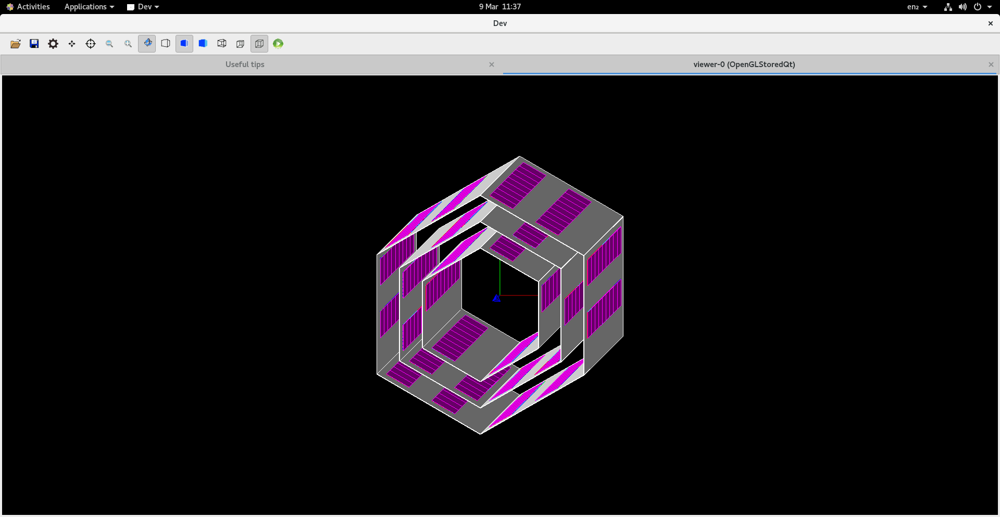
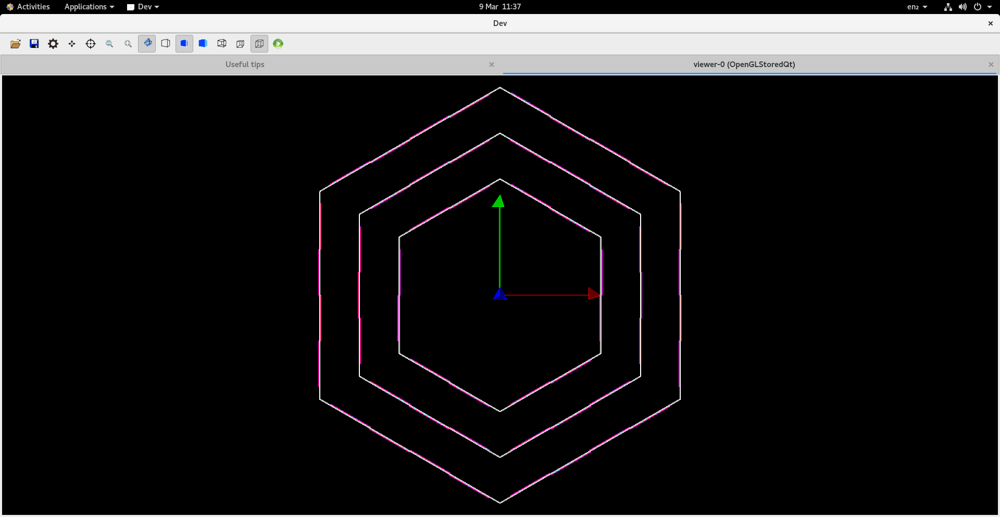

# Development timeline for the first 4 weeks of the project

## The cold plates were initially generated using an assembly volume.

## The thickness was fixed and all 3 layers were added

## Orientation was fixed and a scale was shown

## Assembly volume was scrapped and mother volumes where used to create the HCI unit ontop of the cold plate

## Multiple, alternating HCI units were placed on the plate

## Stave C was generated

## All staves were added in the correct shape

## Added sensitive detectors ("Chips" layers only)

## NOTE the printout showing each layers is distinct from eachother

## Implimented the ability for the program to count the number of hits on each sensitive detector throughout the run and calculate the efficiency

However, sometimes a secondary particle is generated and scatters multiple times within the sensitive detectors, causing multiple counts. Notice the count of 15 hits on the stave C layer. 

## First efficiency outcome

After a full run simply counting the number of particles that hit each layer without taking scattering, or secondary particles into account the efficiency was calculated. A 100% efficiency would mean the layer has been hit 200480 times since there are 2 particles generated for each of the 100240 events.

|Layer     |Hits   |Efficiency|
 ------- | ----- | -------- 
D (4 HCIs)|139,147|69.4%
C (3 HCIs)|151,834|75.7%
B (2 HCIs)|153,856|76.7%

After adding a stacking action to delete all particles except the initial protons (removing secondary particles so they arent counted if they hit the detector multiple times as shown above) the efficiency changes.

|Layer     |Hits   |Efficiency|
 ------- | ----- | -------- 
D (4 HCIs)|133,279|66.5%
C (3 HCIs)|144,275|72.0%
B (2 HCIs)|148,442|74.0%

This makes sense because the number of hits isn't being inflated by the extra hits by electrons. Though, there is still the issue of the original protons scattering and hitting the detector multiple times.

## Getting total system efficiency

To get the total efficiency, what constitutes a valid and invalid event must be defined rather than just counting the number of hits on each detector. If either particle misses more than 1 layer the whole event is invalid. However, since there are 3 layers, there are different levels of success for each valid event. These levels were defined the experiment was run to calculate the total efficiency of the system.

 - Total Efficiency: 51.9%
 
|Level of Success|Definition|Percentage of Valid Events|
|---|---|---|
|Good|C + B _or_ C + B + D|90.4%|
|Alright|C + D|8.7%|
|Bad|B + D|0.9%|
